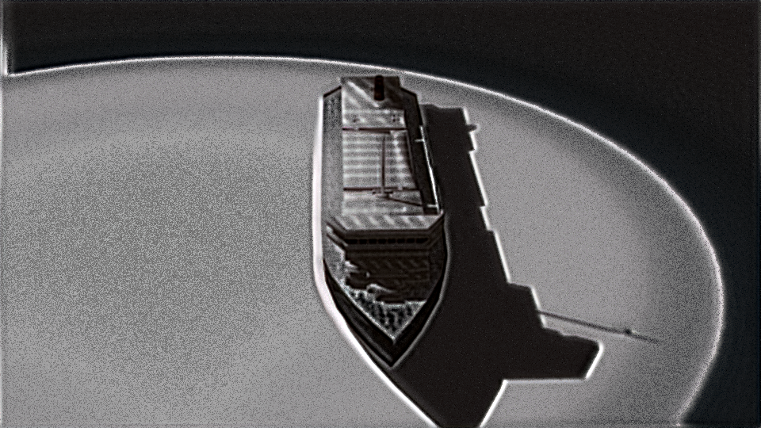
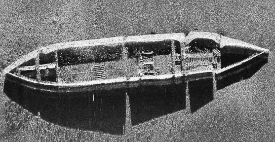
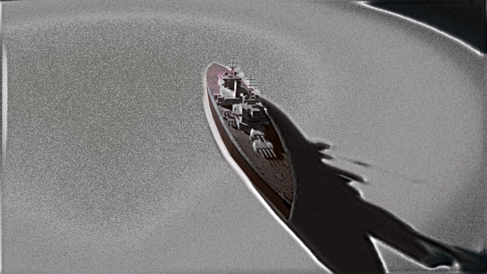

# Sonar-Style-Transfer

Exploring application of computer vision in domain of sonar imaging. 

## Table of Contents
* [Introduction](#intro)
* [Acknowledgements](#ackn)
* [Tasks](#tasks)
* [Dataset](#dataset)
* [Scene Generation](#generation)
* [Modelling](#training)
* [Style Transfer](#nst)
* [Contrastive Unpaired Translation](#cut)
* [Evaluation](#eval) 
* [Results](#results)

## Introduction  

The application of computer vision in domain of sonar imaging is very limited due to insufficient public sonar image datasets. 
Availability of a large-scale sonar dataset would enable applications like underwater object detection, mine detection etc. 
The main goal of this work is to create a large-scale synthetic dataset of sonar images using synthetic images of underwater like objects generated using 3D modelling softwares and then using Neural Style Transfer to transfer the style of real sonar images to synthtic images. This repo aims to provide script for the above tasks and extend to other sonar imaging tasks in future. 

## Acknowledgements  

This project was made possible with previous contributions referenced below: 
<ol>
  <li> https://github.com/gordicaleksa/pytorch-neural-style-transfer </li>
  <li> https://github.com/mvaldenegro/marine-debris-fls-datasets </li>
  <li> https://github.com/taesungp/contrastive-unpaired-translation </li> 
</ol>

## Tasks 

We perform following tasks and also provide the code for the same : 

- [:heavy_check_mark:] [Scene Generation : **Blender**](/Scene%20Generation)  
- [:heavy_check_mark:] [Self Supervised Learning : **RotNet**](/Modelling)  
- [:heavy_check_mark:] [Style Transfer : **VGG19**](/Style%20Transfer) 
- [:heavy_check_mark:] [Evaluation : **FID**](/Evaluation)  
- [:white_circle:] [Multi Image Style Transfer](/)  

Further tasks will be added in the future according to progress of the project. 

## Dataset  

We use various 3D models of objects like ships and airplanes from the web to generate synthetic data using Blender. 
For pretraining of VGG-19 using RotNet methodoly we make use of [**Forward-Looking Sonar Marine Debris Datasets**](https://github.com/mvaldenegro/marine-debris-fls-datasets) combined with dataset of submerged ships and aeroplanes.

## Scene Generation  

We utilized Blender for generating 2D images of 3D objects in similar underwater environment. Blender’s embedded interpreter provides a typical Python environment to code and many operations can be automated using this python API. We wrote a python script which renders multiple images of the models at all possible angles, given a model, camera and light at a certain angle. 
The provided script can be used to generate a database of synthetic images ready for style transfer. 

## Modelling  

The base VGG-19 model pre-trained on ImageNet dataset might not be a good fit for extracting features from the sonar images. Generally, we need a labelled data for training such a network, but we can use self-supervised learning approaches to teach the model to act as feature extractor. The ROTNET algorithm is simple, the premise is the same, we only change the learning task. Instead of classifying the type of object, we rotate the images present in our unlabeled dataset and teach our model to predict the classes.

We perform self supervised learning by finetuning the base VGG-19 model using RotNet methodology using the above mentioned datasets. We rotate each image four times i.e. 0, 90, 180, 270 degrees and teach the model to classify the right angle of the input image. We train the model for 30 epochs. 

## Style Transfer  

Neural Style Transfer (NST) is the technique of blending style from one image to another while preserving the original image’s content. 

### Methodology 

NST employs a pre-trained VGG-19 (feature extractor) with added loss functions to transfer style from one image to another and synthesize a newly generated image with the features we want to add. We leverage different layers of model to describe content and style of input images. Higher layer features correspond more to content image while to represent style we use correlation between different filter responses. 

Total sum of two losses are minimized by the model : 
- Content Loss: It is the Euclidean distance between content and generated image.
- Style Loss: It is the difference between Gram matrices of style and generated image. 

### Parameters 

We needed to tune hyperparameters of our style transfer network to get the optimal results, we tweaked following parameters and assigned optimal values :

- Style weight : `3e4`
- Content weight : `1e7`
- Candidate layers : `conv4_1`
 
### Sample Script

1. Copy content images to the default content image directory: `/data/content-images/`
2. Copy style images to the default style image directory: `/data/style-images/`
3. Run `python neural_style_transfer.py --content_img_name <content-img-name> --style_img_name <style-img-name>`

## Contrastive Unpaired Translation  

One approach for unpaired image to image translation is CUT. Unlike CycleGAN, which uses a cycle consistency loss to enforce consistency between the translated images and the original input images it uses contrastive loss. 

### Methodology 

CUT is encoder decoder based model where both are trained to encode and decode images from each domain and then we use contrastive loss to encourage similarity. 
The method encourages two elements (corresponding patches) to map to a similar point in a learned feature space, relative to other elements (other patches) in the dataset, referred to as negatives.

The contrastive loss encourages the model to preserve the content of the original image by minimizing the distance between the original and translated images in the shared latent space. They also experimented with high resolution single image translation which gave the best results for our usecase. 

### Sample Script

Right now the code for training sinCUT and inference is provided in [this](https://colab.research.google.com/drive/1udFsyuJAWpLWp2QLZKwhfJyYhfDeMJSo) notebook. 

## Evaluation  

The Frechet Inception Distance score, or FID for short, is a metric that calculates the distance between feature vectors calculated for real and generated images.
Since the SONAR images are in themselves very varied and so manually comparing them is not an efficient solution. So we used a matric known as the Frechet Inception Distance to figure out if we have managed to achieve any resemblance.   

| Data      | FID |
| ----------- | ----------- |
| Sonar vs Sonar      | ~170       |
| Generated vs Generated   | ~207        |
| Generated vs Sonar   | ~247        |

## Results 

Here are some results along with their style images :

### NST  

### CUT 

